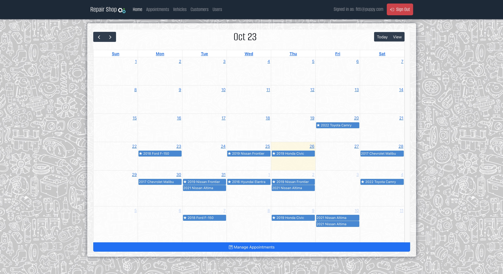
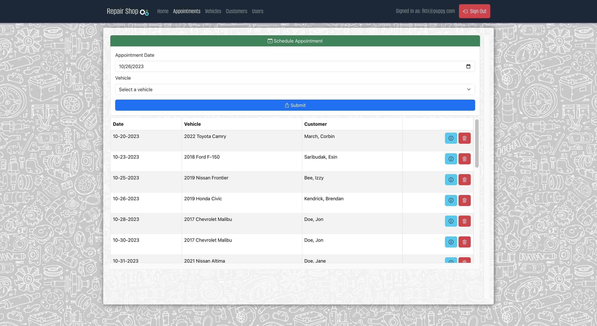
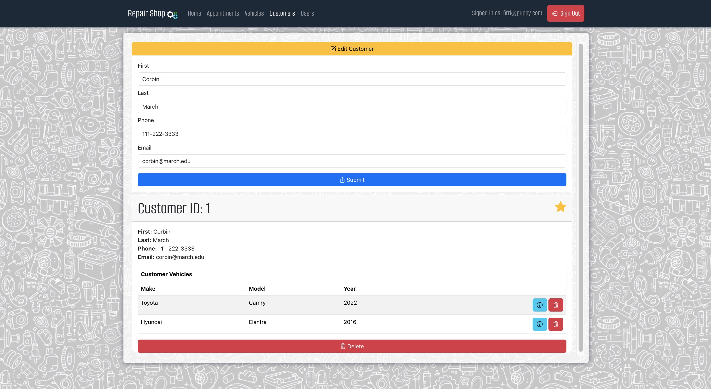

# Repair Shop

[](https://opensource.org/licenses/MIT)

## Index

1. [Description](#description)
2. [Installation](#installation)
3. [Usage](#usage)
4. [Features](#features)
5. [Technology](#technology)
6. [Contributing](#contributing)
7. [Resources](#resources)
8. [License](#license)

## Description

```
AS the owner of a vehicle repair business

I WANT employees and managers to be able to log into an application that gives them all of the tools and information necessary to the requirements of their position

SO THAT they can manage the business through a single page application
````

## Usage

This app is not yet deployed. From a development perspective, this app uses Node.js, mySQL, React and Java. See the technology list below for more detail.

## Features

The following features exist:

1. This application is a single page application built using the SQL, Java, and Typescript. When users first navigate to the page they see a landing page calling them to sign-in.
2. When users log in they are taken to the home page displaying a calendar of appointments. Using the Navigation Bar at the top users can navigate to the appointments, vehicles, or customers page (if user is an Administrator, they can navigate to users page)
3, The calendar is interactive and can viewed by either month-grid or list. When a user clicks on an event in the calendar they are taken to the appointment detail page.
4. From the appointments page, a user can add an appointment via accordion-form at the top, delete an appointment, or navigate to an appointments detail page.
5. From the vehicles page, a user can add a vehicle via accordion-form at the top, delete a vehicle, or navigate to an vehicles detail page.
6. From the customers page, a user can add a customer via accordion-form at the top, delete a customer, or navigate to a customer's detail page.
7. From the users page, an admin can add a user via accordion-form at the top, delete a user, or navigate to a user's detail page.
8. From the appointment detail page, a user can edit the appointment via accordion-form at the top or delete the appointment.
9. From the vehicle detail page, a user can edit the vehicle via accordion-form at the top or delete the vehicle.
10. From the customer detail page, a user can edit the customer via accordion-form at the top, select/de-select the star to indicate the customers importance, or delete the customer.
11. From the user detail page, an admin can edit the user via accordion-form at the top or delete the user.
12. Users can only be created by the Administrator, if a potential user does not have login credentials they can contact teh admin via the link in the sign-up modal (will open default mail application to send email to admin's email address).


## Future Enhancements:

1. Create a `LaborItem` model and attach those items to each appointment to determine appointment time. Create an appointment limit per day based on shop's available labor hours.
2. Deploy the application.
3. Create a search bar on each page as employees and clientele grow.

## Technology

1. `React:` App created with TypeScript template.
2. `Git/Github:` Repo and version management.
3. `mySQL`: Database.
4. `React-Bootstrap`: For most of the CSS styling.
5. `Java`: Backend data, domain, and controller layers.
6. `JUnit`: Backend data, domain, and controller layers.
7. `jsonwebtoken/jwt`: For user authentication.
8. `SpringMVC`, `SpringBoot`, `SpringSecurity`: Backend "framework" and security.
9. `TypeScript`: Programming language that adds static typing with optional type annotations and transpiles to JavaScript.
10. NPM Packages: `react-bootstrap`, `fullCalendar`, `react-lottie`, `bootstrap-icons`, `toastify`.

## Website Preview

### Demo Video

* [Link to WalkThrough Video](https://www.youtube.com/watch?v=P5qFd1Pb_XY)

### Static Screenshots







## Tests

Full unit-testing suite for back-end available via JUnit testing. Best employed using IntelliJ IDEA.

## Installation

Setup: 
- (1) Fork the repo, (2) Clone the forked repo locally, (3) Run "npm install" from client directory (to install the dependencies).

Setup the Database Schema: 
- (1) Run the sql scripts (repair-shop/server/sql) using MySQLWorkbench

Setup Back-End Configurations/Start the Server:
- (1) edit your run configurations or edit the application.properties file (repair-shop/server/src/main/resources && repair-shop/server/src/test/resources). (2) Run all tests from the server/src/test/java directory twice, ensure that all 54 tests pass. (3) Start the server via App.java.

  Server-Side 'application.properties:
  * spring.datasource.url=${REPAIR_DB_URL}
  * spring.datasource.username=${REPAIR_DB_USERNAME}
  * spring.datasource.password=${REPAIR_DB_PASSWORD}

Start the Client-Side Application:
- (1) Using the terminal, cd into the client directory, (2) enter the command `npm start` into the terminal.

Either obtain credentials from the user table (SELECT * FROM user;) or use an option noted below:

  * username: fitt@puppy.com, password: "P@ssw0rd!" (note role is admin)
  * username: patrick@ratcliff.com, password: "P@ssw0rd!" (note role is user)

## Contributing

Contributor Covenant Code of Conduct

[](https://www.contributor-covenant.org/version/2/1/code_of_conduct/code_of_conduct.md)


## Creator/Developer

* [Patrick Ratcliff - GitHub Profile](https://github.com/PatrickARatcliff)

## Resources

1. GitHub Repo: <https://github.com/PatrickARatcliff/repair-shop>
3. Deploy URL: TBD

## License

[](https://opensource.org/licenses/MIT)
This project is licensed under the terms of the <span style="color:red">The MIT License</span>. Please click on the license badge for more information.

User Story: AS the owner of a vehicle repair business I WANT employees and managers to be able to log into an application that gives them all of the tools and information necessary to the requirements of their position SO THAT they can manage the business through a single page application

Overview of the "Repair Shop" Application:

The "Repair Shop" is a single-page application (SPA) created using MySQL, Java, and React. The database schema was designed using MySQL Workbench. The application has a robust backend (API) with data, domain, and controller layers implemented in Java, along with comprehensive JUnit testing. The frontend (UI) was constructed using React and coded in TypeScript.

Development Approach:

I followed a detailed plan (available in the directory as PLAN.md) to guide the development process. The project was developed back-to-front, with the following phases:

For the API, I first constructed the database, followed by the data layer, domain layer, and finally the controller layer.
For the UI, I began by creating services for each model, then designed the associated pages, and finished by creating the necessary components.
Key Application Features:

Login Page: The application is a single-page application built using SQL, Java, and TypeScript. When users first access the page, they are greeted with a landing page that prompts them to sign in.

Home Page: Upon logging in, users are taken to the home page, which displays a calendar of appointments. The navigation bar at the top allows users to move between the Appointments, Vehicles, and Customers pages. Administrators have the additional ability to access the Users page.

Interactive Calendar: The calendar is interactive and can be viewed in either a month-grid or list format. Clicking on an event in the calendar takes the user to the appointment detail page.

Appointments Page: Users can add appointments via an accordion-form at the top, delete appointments, or navigate to an appointment's detail page.

Vehicles Page: Users can add vehicles via an accordion-form at the top, delete vehicles, or navigate to a vehicle's detail page.

Customers Page: Users can add customers via an accordion-form at the top, delete customers, or navigate to a customer's detail page.

Users Page (Administrators Only): Administrators can add users via an accordion-form at the top, delete users, or navigate to a user's detail page.

Appointment Detail Page: Users can edit appointments via an accordion-form at the top or delete the appointment.

Vehicle Detail Page: Users can edit vehicle details via an accordion-form at the top or delete the vehicle.

Customer Detail Page: Users can edit customer details via an accordion-form at the top, select/de-select a star to indicate customer importance, or delete the customer.

User Detail Page (Administrators Only): Administrators can edit user details via an accordion-form at the top or delete the user.

User Creation: Users can only be created by the Administrator. If a potential user lacks login credentials, they can contact the admin via the link in the sign-up modal. This link will open the default email application to send an email to the admin's email address.

***A more detailed explanation of the application is available in README.md located in the projects root directory***

GitHub Repo: https://github.com/PatrickARatcliff/repair-shop

1. React: App created with the TypeScript template.
2. Git/GitHub: Repository and version management.
3. MySQL: Database.
4. React-Bootstrap: Used for most of the CSS styling.
5. Java: Backend data, domain, and controller layers.
6. JUnit: Backend testing for data, domain, and controller layers.
7. SON Web Token (jsonwebtoken/JWT): Used for user authentication.
8. Spring MVC, Spring Boot, Spring Security: Backend frameworks and security.
9. TypeScript: Programming language.
10. NPM Packages: React-Bootstrap, FullCalendar.io, React-Lottie, Bootstrap-icons, Toast.