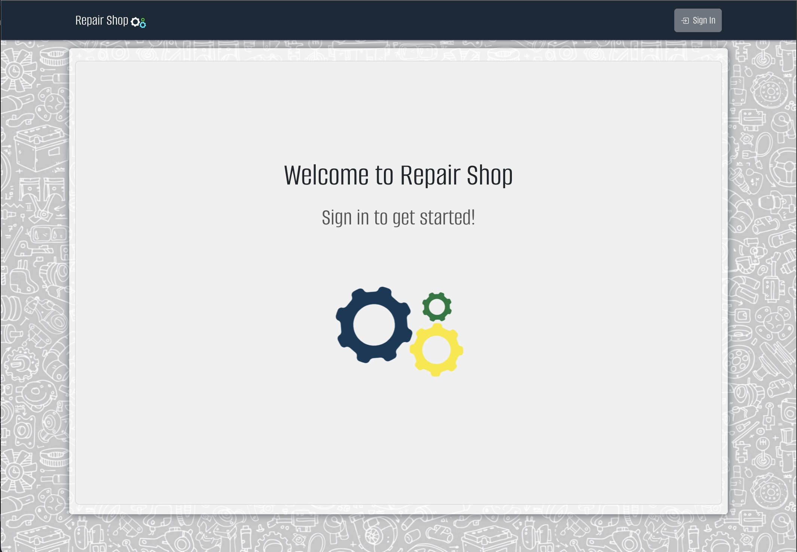

# Repair Shop

[](https://opensource.org/licenses/MIT)

## Index

1. [Description](#description)
2. [Installation](#installation)
3. [Usage](#usage)
4. [Features](#features)
5. [Technology](#technology)
6. [Contributing](#contributing)
7. [Resources](#resources)
8. [License](#license)

## Description

```
AS the owner of a vehicle repair business

I WANT employees and managers to be able to log into an application that gives them all of the tools and information necessary to the requirements of their position.

SO THAT they can manage the business through a single page application
````

## Usage

This app is not yet deployed. From a development perspective, this app uses Node.js, mySQL, React and Java. See the technology list below for more detail.

## Features

The following features exist:

1. This application is a single page application built using the SQL, Java, and Typescript. When users first navigate to the page they see a landing page calling them to sign-in.
2. When users log in they are taken to the home page displaying a calendar of appointments. Using the Navigation Bar at the top users can navigate to the appointments, vehicles, or customers page (if user is an Administrator, they can navigate to users page)
3, The calendar is interactive and can viewed by either month-grid or list. When a user clicks on an event in the calendar they are taken to the appointment detail page.
4. From the appointments page, a user can add an appointment via accordion-form at the top, delete an appointment, or navigate to an appointments detail page.
5. From the vehicles page, a user can add a vehicle via accordion-form at the top, delete a vehicle, or navigate to an vehicles detail page.
6. From the customers page, a user can add a customer via accordion-form at the top, delete a customer, or navigate to a customer's detail page.
7. From the users page, an admin can add a user via accordion-form at the top, delete a user, or navigate to a user's detail page.
8. From the appointment detail page, a user can edit the appointment via accordion-form at the top or delete the appointment.
9. From the vehicle detail page, a user can edit the vehicle via accordion-form at the top or delete the vehicle.
10. From the customer detail page, a user can edit the customer via accordion-form at the top, select/de-select the star to indicate the customers importance, or delete the customer.
11. From the user detail page, an admin can edit the user via accordion-form at the top or delete the user.
12. Users can only be created by the Administrator, if a potential user does not have login credentials they can contact teh admin via the link in the sign-up modal (will open default mail application to send email to admin's email address).


## Future Enhancements:

1. Create a `LaborItem` model and attach those items to each appointment to determine appointment time. Create an appointment limit per day based on shop's available labor hours.
2. Deploy the application.
3. Create a search bar on each page as employees and clientele grow.

## Technology

1. `React:` App created with TypeScript template.
2. `Git/Github:` Repo and version management.
3. `mySQL`: Database.
4. `React-Bootstrap`: For most of the CSS styling.
5. `Java`: Backend data, domain, and controller layers.
6. `JUnit`: Backend data, domain, and controller layers.
7. `jsonwebtoken/jwt`: For user authentication.
8. `SpringMVC`, `SpringBoot`, `SpringSecurity`: Backend "framework" and security.
9. `TypeScript`: Programming language that adds static typing with optional type annotations and transpiles to JavaScript.
10. NPM Packages: `react-bootstrap`, `fullCalendar`, `react-lottie`, `bootstrap-icons`, `toastify`.

## Website Preview

### Demo Video

* [Link to WalkThrough Video](https://www.youtube.com/watch?v=P5qFd1Pb_XY)

### Static Screenshots




## Tests

Full unit-testing suite for back-end available via JUnit testing. Best employed using IntelliJ IDEA.

## Installation

Setup: 
- (1) Fork the repo, (2) Clone the forked repo locally, (3) Run "npm install" from client directory (to install the dependencies).

Setup the Database Schema: 
- (1) Run the sql scripts (repair-shop/server/sql) using MySQLWorkbench, (2) edit your run configurations or edit the application.properties file (repair-shop/server/src/main/resources && repair-shop/server/src/test/resources).

  Server-Side 'application.properties:
  * spring.datasource.url=${REPAIR_DB_URL}
  * spring.datasource.username=${REPAIR_DB_USERNAME}
  * spring.datasource.password=${REPAIR_DB_PASSWORD}


Either obtain credentials from the user table (SELECT * FROM user;) or use an option noted below:

  * username: fitt@puppy.com, password: "P@ssw0rd!" (note role is admin)
  * username: patrick@ratcliff.com, password: "P@ssw0rd!" (note role is user)

## Contributing

Contributor Covenant Code of Conduct

[](https://www.contributor-covenant.org/version/2/1/code_of_conduct/code_of_conduct.md)


## Creator/Developer

* [Patrick Ratcliff - GitHub Profile](https://github.com/PatrickARatcliff)

## Resources

1. GitHub Repo: <https://github.com/PatrickARatcliff/repair-shop>
3. Deploy URL: TBD

## License

[](https://opensource.org/licenses/MIT)
This project is licensed under the terms of the <span style="color:red">The MIT License</span>. Please click on the license badge for more information.
